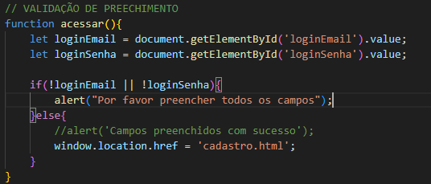
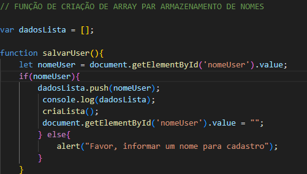
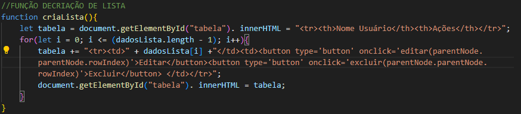
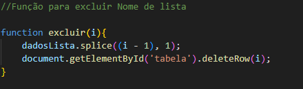
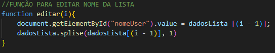
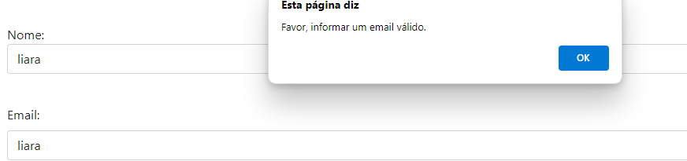
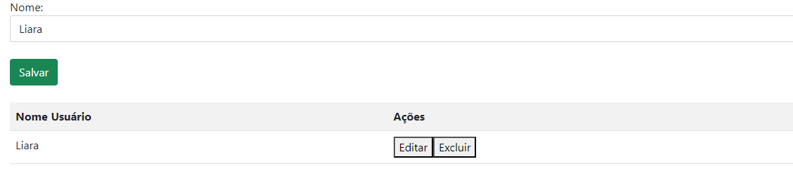
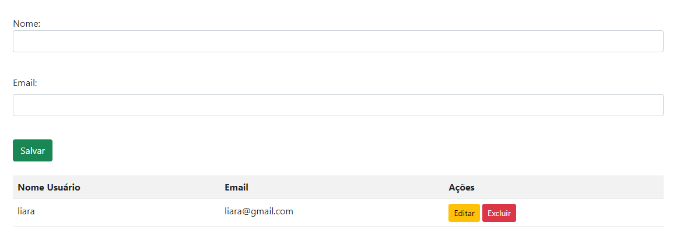

<h1 align="center"> Sistema de Cadastro de Usuario </h1>

 ## Descrição:
O projeto é uma aplicação web simples que valida os campos preenchidos de entrada de um formulário de cadastro. Ele garante que o usuário preencha todos os campos obrigatórios e consiga salvar seu nome e poder editar caso tenha escrevido errado ou excluir caso não queira ter o nome na lista.

### VALIDAÇÃO DE PREECHIMENTO

### let loginEmail = document.getElementById('loginEmail').value;

Obtém o valor do campo de entrada (input) com o id loginEmail e o armazena na variável loginEmail.

### let loginSenha = document.getElementById('loginSenha').value;

Obtém o valor do campo de entrada (input) com o id loginSenha e o armazena na variável loginSenha.

### if(!loginEmail || !loginSenha)

Verifica se qualquer um dos valores (loginEmail ou loginSenha) está vazio ou undefined. Se um dos valores for falso (ou seja, vazio), a condição é verdadeira.

### alert("Por favor preencher todos os campos");

Se a condição do if for verdadeira (ou seja, algum campo estiver vazio), exibe um alerta com a mensagem "Por favor preencher todos os campos".

### window.location.href = 'cadastro.html';

Se ambos os campos estiverem preenchidos, o navegador será redirecionado para a página cadastro.html.

### Função criador de Arrey para armazenamento de nomes

### var dadosLista = [];

Inicia como um array vazio. Este array será usado para armazenar os nomes inseridos pelo usuário.
 
 ### function salvarUser ()

A função salvarUser, que será chamada quando o usuário deseja salvar um nome.

### let nomeUser = document.getElementById('nomeUser').value;

Dentro da função, declara uma variável nomeUser e a inicializa com o valor do campo de entrada com o id nomeUser. A função document.getElementById('nomeUser').value recupera o valor digitado pelo usuário no campo de entrada.

### if(nomeUser)

Verifica se a variável nomeUser não está vazia (ou seja, se o usuário digitou algum texto). O código dentro do if será executado se essa condição for verdadeira.

###  dadosLista.push(nomeUser);

Adiciona o valor de nomeUser ao array dadosLista usando o método push(), que adiciona um item ao final do array.

###  console.log(dadosLista);

Exibe o conteúdo atual do array dadosLista no console. Isso é útil para depuração, para verificar se o nome foi corretamente adicionado ao array.

###  criaLista();

Chama a função criaLista() para atualizar a exibição da lista de nomes na página. Essa função irá criar e mostrar uma lista HTML com os nomes armazenados no array.

### document.getElementById('nomeUser').value = "";

 Limpa o campo de entrada nomeUser após o nome ser salvo, definindo seu valor como uma string vazia.

 ### else alert("Favor, informar um nome para cadastro");

Se o campo de entrada estiver vazio (ou seja, a condição do if não for verdadeira), exibe uma mensagem de alerta pedindo para o usuário informar um nome para cadastro.

## Função decriação de Lista

### let tabela = document.getElementById("tabela").innerHTML = "<tr><th>Nome Usuário</th><th>Ações</th></tr>";

 Esse código obtém o elemento HTML com o id tabela e define seu innerHTML inicial com um cabeçalho de tabela (<tr><th>Nome Usuário</th><th>Ações</th></tr>). Esse cabeçalho define as colunas da tabela: uma para o nome do usuário e outra para ações (editar e excluir). O valor de innerHTML é armazenado na variável tabela.

 ### for(let i = 0; i <= (dadosLista.length - 1); i++)

 Inicia um loop for que itera sobre cada índice do array dadosLista. A condição i <= (dadosLista.length - 1) garante que o loop percorra todos os elementos do array.

 ### tabela += "<tr><td>" + dadosLista[i] +"</td><td><button // type='button' onclick='editar(parentNode.parentNode.rowIndex)'>Editar</button><button // type='button' onclick='excluir(parentNode.parentNode.rowIndex)'>Excluir</button></td></tr>";

 Adiciona uma nova linha (<tr>) à variável tabela para cada nome no array dadosLista. Cada linha da tabela contém:
* Uma célula (<td>) com o nome atual do array (dadosLista[i]).
* Uma célula com dois botões:
* Editar: Um botão que chama a função editar passando o índice da linha (parentNode.parentNode.rowIndex), que representa a linha onde o botão foi clicado.
* Excluir: Um botão que chama a função excluir também passando o índice da linha (parentNode.parentNode.rowIndex).

### document.getElementById("tabela"). innerHTML = tabela;

Define o innerHTML do elemento com o id tabela para o valor da variável tabela. Isso atualiza a tabela na página com todas as linhas (nomes e botões) que foram adicionadas no loop.

## Função para excluir Nome de lista 

### function excluir(i)

Define a função excluir, que aceita um argumento i. Esse argumento representa o índice da linha da tabela que deve ser excluída. A função é chamada quando o usuário clica no botão "Excluir" correspondente a uma linha na tabela.

### dadosLista.splice((i - 1), 1);

 Usa o método splice do array dadosLista para remover um item do array. O método splice modifica o array original. Aqui está o que os parâmetros fazem:
* (i - 1): Especifica o índice no array onde a remoção deve começar. Como i é o índice da linha da tabela e o array dadosLista pode ser indexado a partir de zero, você precisa subtrair 1 para obter o índice correto no array.
* 1: O número de itens a serem removidos a partir do índice especificado. Neste caso, está removendo apenas um item.

### document.getElementById('tabela').deleteRow(i);

Usa o método deleteRow do objeto HTMLTableElement para remover a linha da tabela na página. O método deleteRow remove uma linha da tabela HTML com base no índice especificado. No caso, i é o índice da linha a ser removida.

## Função para editar Nome da Lista

### function editar(i)

Define a função editar que recebe um argumento i, que representa o índice da linha da tabela a ser editada.

### document.getElementById("nomeUser").value = dadosLista[(i - 1)]

Define o valor do campo de entrada com o id nomeUser para o valor do nome correspondente ao índice i - 1 no array dadosLista. Isso preenche o campo de entrada com o nome que pode ser editado pelo usuário. O índice i - 1 é usado para ajustar a diferença entre os índices da tabela (começando do 1) e do array (começando do 0).

### dadosLista.splice(dadosLista[(i - 1)], 1);

Remove o nome do array para que ele não apareça mais na tabela

### Splice

O método splice em JavaScript é uma função poderosa e versátil usada para modificar arrays. Ele pode adicionar, remover e substituir elementos dentro de um array. 

### Alterações 

Adicionamos o termo email para que as pessoas consigam colocar o email valido e se não estiver o @ ou o . ele ira alertar um aviso para a pessoa coloque um email valido.

# Resultado:

# Novo Ajustamento:

-[Liara Silva](https://github.com/LiaraSilva?tab=repositories)